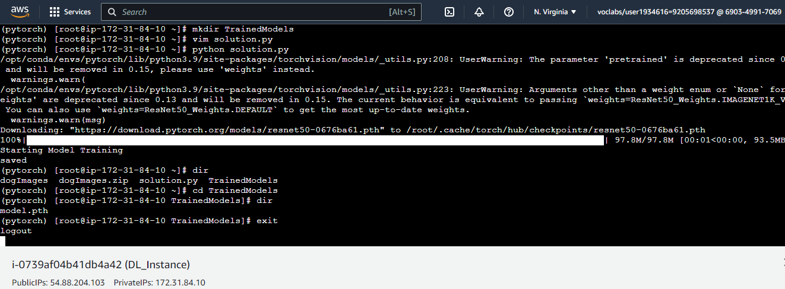
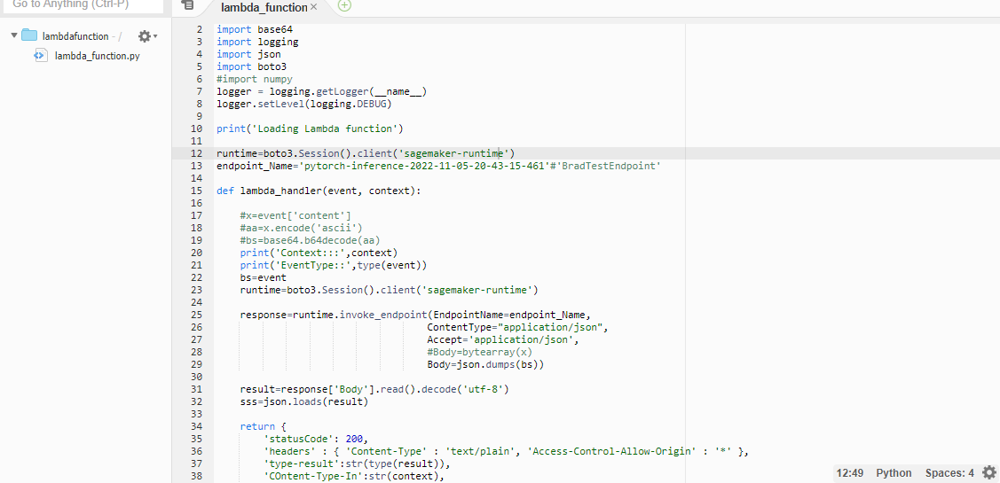

# Operationalizing an AWS Machine Learning.


[source Udacity](https://www.udacity.com/course/aws-machine-learning-engineer-nanodegree--nd189)

In this project, I completed the following steps:

1. Train and deploy a model on Sagemaker, using the most appropriate instances. Set up multi-instance training in Sagemaker notebook.
2. Adjusted Sagemaker notebooks to perform training and deployment on EC2.
3. Set up a Lambda function for deployed model. Set up auto-scaling for my deployed endpoint as well as concurrency for my Lambda function.
4. Ensured that the security on my ML pipeline is set up properly.
   
## Training and deployment on Sagemaker

### Reason for using ml.t3.medium notebook instance:


* Cost saving using this instance:
  * ml.t3.medium costs $0.05 an hour this can be seen on the sagemaker [pricing page](https://aws.amazon.com/sagemaker/pricing/)
* This instance will be used for workloads like download of images and upload to S3 and will be used to create training jobs and deployment.
  * Training and Model deployments will depend on the compute power of instances ml.m5.xlarge used for both hyperparameter tuning and Estimator training. and ml.m5.large instance used for model deployment.	

### Download data to an S3 bucket


After creating bucket, reference to the data path is as follows:
```py
%%capture
!wget https://s3-us-west-1.amazonaws.com/udacity-aind/dog-project/dogImages.zip
!unzip dogImages.zip
!aws s3 cp dogImages s3://sagemaker-bucket-05-11-2022/ --recursive

os.environ['SM_CHANNEL_TRAINING']='s3://sagemaker-bucket-05-11-2022/'
```

After downloading data from url,then unzip the `dogImages.zip` next is to download the data to S3 using the part `s3://sagemaker-bucket-05-11-2022/` 

`os.environ['SM_CHANNEL_TRAINING']` represents the Training path to the directory that contains the input data for this channel.

### Training and Deployment

```python
estimator = PyTorch(
    entry_point='hpo.py',
    base_job_name='dog-pytorch',
    role=role,
    instance_count=1,
    instance_type='ml.m5.xlarge',
    framework_version='1.4.0',
    py_version='py3',
    hyperparameters=hyperparameters,
    ## Debugger and Profiler parameters
    rules = rules,
    debugger_hook_config=hook_config,
    profiler_config=profiler_config,
)
```


This job `dog-pytorch-2022-11-05-19-00-13-634` is a training job trained. Using pytorch estimator, I trained my model using `instance_count=1`  thus training the model in `hpo.py` using 1 instances of `ml.m5.xlarge`.

```py

SageMaker training of your script is invoked when you call fit on the PyTorch Estimator. 

estimator.fit({"training": "s3://sagemaker-bucket-05-11-2022/"}, wait=False)
```


After training, I deploy the endpoint. As seen above.

### Multi-instance Training

```py
estimator = PyTorch(
    ...
    instance_count=3,
    instance_type='ml.m5.xlarge',
    ...
)
```
```py
estimator.fit({"training": "s3://sagemaker-bucket-05-11-2022/"}, wait=False)
```


Using pytorch estimator, I created multi-instance training using `instance_count=3`  thus training the model in `hpo.py` using 3 instances of `ml.m5.xlarge`.

**Deployed new endpoint that was trained on multiple intances**


After which this training job was deployed. As seen above 2 enpoints are active, for the 2 trained jobs created with `starter/train_and_deploy-solution.ipynb` notebook.

## EC2 Training


An Amazon Deep Learning AMI Linux 2 was selected for the EC2 instance, this is to use deep learning libraries. Here I selected an Amazon Linux OS with PyTorch conda environment. 


This instance type selected is comparable has some cost savings when compared with `ml.m5.xlarge` used for sagemaker training.
|Attributes|ml.m5.xlarge|t2.xlarge|
|---|---|---|
|CPU|4|4|
|Memory|16|16|
|Price per hour|$0.23|$0.1856| 
`t2.xlarge` instance is approximately 20% cheaper than `ml.m5.xlarge` even though there CPU and Memory attributes are same.


The training was done using EBS as storage.

|Characteristics|S3|EBS|EFS|Glacier|
|---|---|---|---|---|
|Speed|Moderate|Fastest|Moderate|Slowest|
|Use case|Unstructured data|EC2-system storage|EC2-scalable storage|Long-term storage of huge datasets|
|Interface|Web interface|File system interface|Web & file system interface|File system interface|

In sagemaker we used `S3` for our training, but training on EC2 instance the training files is done on EBS which the fastest data store.


```batch
wget https://s3-us-west-1.amazonaws.com/udacity-aind/dog-project/dogImages.zip
unzip dogImages.zip

mkdir TrainedModels

vim solution.py

:set paste

python solution.py

cd TrainedModels
```
Seen Above both screenshot and commands used for training in the EC2 instance. 
`vim solution.py` creates and open the vim text editor file `solution.py` in the EC2 terminal. `:set paste` enables pasting the code from `starter/ec2train1.py` into the `solution.py`.

`python solution.py` is a command used to run the code.


This show the model trained model as seen above `model.pth` saved in TrainedModel directory.

Writing on EC2 instance is cheaper and  also faster, but not userfriendly when compared to Sagemaker Notebook or Studio.


## Construct pipeline for high throughput low latency models

[source Udacity](https://www.udacity.com/course/

### Lambda function setup

Lambda functions enable your model and its inferences to be accessed by API's and other programs, so it's a crucial part of production deployment.


I created a lambda function called `lambdafunction`. The code below invokes deployed endpoint which is used to make predictions of dogbreed images.

```py
import base64
import logging
import json
import boto3
#import numpy
logger = logging.getLogger(__name__)
logger.setLevel(logging.DEBUG)

print('Loading Lambda function')

runtime=boto3.Session().client('sagemaker-runtime')
endpoint_Name='pytorch-inference-2022-11-05-20-43-15-461'#'BradTestEndpoint'

def lambda_handler(event, context):

    #x=event['content']
    #aa=x.encode('ascii')
    #bs=base64.b64decode(aa)
    print('Context:::',context)
    print('EventType::',type(event))
    bs=event
    runtime=boto3.Session().client('sagemaker-runtime')
    
    response=runtime.invoke_endpoint(EndpointName=endpoint_Name,
                                    ContentType="application/json",
                                    Accept='application/json',
                                    #Body=bytearray(x)
                                    Body=json.dumps(bs))
    
    result=response['Body'].read().decode('utf-8')
    sss=json.loads(result)
    
    return {
        'statusCode': 200,
        'headers' : { 'Content-Type' : 'text/plain', 'Access-Control-Allow-Origin' : '*' },
        'type-result':str(type(result)),
        'COntent-Type-In':str(context),
        'body' : json.dumps(sss)
        #'updated_result':str(updated_result)

        }
```
`runtime=boto3.Session().client('sagemaker-runtime')` invokes the sagemaker runtime environment.

In the above code, `runtime.invoke_endpoint(...)` invokes endpoint using name of the endpoint `endpoint_name`,`body` provides input data, in the format specified in the `ContentType` which is application/json here is json format.
This gets inference from the model hosted at this endpoint `pytorch-inference-2022-11-05-20-43-15-461`.

this can be seen in the test event. as this is the `event`.

```json
{ 
    "url": "https://s3.amazonaws.com/cdn-origin-etr.akc.org/wp-content/uploads/2017/11/20113314/Carolina-Dog-standing-outdoors.jpg" 
    
}
```

 `Accept` the desired MIME type of the inference in the response which is application/json here.

```py 
result=response['Body'].read().decode('utf-8')
sss=json.loads(result)
```
`read` will return bytes. At least for Python 3 then you have to decode using the right encoding in this case `utf-8`. The 

`loads()` method can be used to parse a valid JSON string and convert it into a Python Dictionary. It is mainly used for deserializing native string, byte, or byte array which consists of JSON data into Python Dictionary. [geeksforgeeks](https://www.geeksforgeeks.org/json-loads-in-python/#:~:text=loads()%20method%20can%20be,JSON%20data%20into%20Python%20Dictionary.)

Then returns a dictionary of 133 classes with there likelihood values.

### Security and testing

The Lambda function can only invoke my endpoint if there is proper security policies attached to it.

Attach a security policy to lambda function that allows it access to sagemaker endpoints.By attaching `AmazonSageMakerFullAccess` it grants this Lambda function access to the endpoints and other sagemaker services.




**Test Event**
{ 
    "url": "https://s3.amazonaws.com/cdn-origin-etr.akc.org/wp-content/uploads/2017/11/20113314/Carolina-Dog-standing-outdoors.jpg" 
    
}

**Response (Predicted values)** 

Test Event Name
Image-class-test

Response
{
  "statusCode": 200,
  "headers": {
    "Content-Type": "text/plain",
    "Access-Control-Allow-Origin": "*"
  },
  "type-result": "<class 'str'>",
  "COntent-Type-In": "LambdaContext([aws_request_id=6389cc62-45ae-41ff-87ee-5eb8442d43b8,log_group_name=/aws/lambda/lambdafunction,log_stream_name=2022/11/05/[$LATEST]f3938c0938764b45902528fc8dc3299c,function_name=lambdafunction,memory_limit_in_mb=128,function_version=$LATEST,invoked_function_arn=arn:aws:lambda:us-east-1:690349917069:function:lambdafunction,client_context=None,identity=CognitoIdentity([cognito_identity_id=None,cognito_identity_pool_id=None])])",
  "body": "[[-5.44008207321167, -4.952992916107178, -1.5317052602767944, -0.5046547651290894, -3.427722454071045, -3.5470330715179443, -2.1158523559570312, -1.5338290929794312, -7.150924205780029, 0.23522217571735382, -0.6767486929893494, -4.5792131423950195, -2.448819875717163, 1.5442739725112915, -4.79373025894165, -3.6146109104156494, -7.377564907073975, -2.806501865386963, -3.56970477104187, 0.6937685608863831, -4.370532989501953, -2.9022064208984375, -6.072688102722168, -4.791072368621826, -4.495667934417725, -4.914665699005127, -0.3236158490180969, -1.770508885383606, -5.172568321228027, -2.3332908153533936, -4.425060272216797, -2.528372049331665, -5.196396350860596, -1.9796003103256226, -8.67808723449707, -7.016977310180664, -4.221601486206055, -1.8513274192810059, -1.2895582914352417, -2.932392120361328, -2.3384647369384766, -3.72230863571167, -0.4528353810310364, -2.516489267349243, -0.7855870127677917, -7.66058874130249, -1.2515116930007935, 0.217243492603302, -3.0159168243408203, -1.0865718126296997, -0.9226453304290771, -6.505958557128906, -7.088664531707764, -2.6274538040161133, -5.69277811050415, -2.5954782962799072, -4.136444091796875, -6.413861274719238, -2.9214165210723877, -1.8026350736618042, -7.051815986633301, -6.990673542022705, -7.743916034698486, -6.82808780670166, -2.714198112487793, -6.730476379394531, 0.8651849031448364, -5.2978010177612305, -1.652145504951477, -0.9539076685905457, 0.27124127745628357, -3.6734120845794678, -5.905435562133789, -3.464625358581543, -5.734074115753174, -1.474758267402649, -6.283289432525635, -1.4405708312988281, -3.6478824615478516, -3.242371082305908, -1.1309401988983154, -4.781346321105957, -0.8546137809753418, -0.9007806777954102, -6.97314977645874, -5.638144493103027, -1.275240421295166, -6.873162269592285, -3.3538429737091064, -2.3007302284240723, -5.834065914154053, -3.1364731788635254, -2.340365409851074, -6.831973552703857, -3.429497241973877, -3.3244616985321045, -3.2669477462768555, -5.467846393585205, -5.630269527435303, -6.411980152130127, -7.864996433258057, -3.741847515106201, -2.0103819370269775, -5.227265357971191, -5.439854145050049, -5.761460304260254, -3.2689850330352783, -2.0540072917938232, -1.9230411052703857, -0.7347715497016907, -3.558453321456909, -1.4514901638031006, -6.587024211883545, -5.59173583984375, -5.957094669342041, -2.426581621170044, -7.154305934906006, -0.4399915337562561, -4.310878276824951, -0.7948324680328369, -2.5780420303344727, -4.45313835144043, -2.9790825843811035, -3.404550313949585, -6.894444942474365, -5.507934093475342, -3.2638163566589355, -2.16451096534729, -3.645242691040039, -5.3472371101379395, -5.278973579406738, -1.2079694271087646, -5.8689680099487305]]"
}
These are measurement of likelihood from each types of dogbreeds from the specified list of classes.

**Any other Vunerabilities that needs to be addressed.**

`FULLAccess` policies attached here too permissive. this enpoint can be secured.Less permisible policies can be attached, also for serverless applications like this, the preferred way to serve a backend application publicly is to use API Gateway. This can help you protect an API from malicious users or spikes in traffic.

Also using Amazon CloudWatch Events you can monitor unwanted users that logged on your endpoint.


### Concurrency and auto-scaling

#### Concurrency

Concurrency refers to the ability of a lambda function to serve multiple requests simultaneously.
Unreserved account concurrency 997 thus amount of lambda instances that I can use if I want to.

Provision concurrency 3 reserved concurrency.
Provision concurrency means that I am creating instances that will alway be on and alway be there to reply to requests.


I used provision concurrency allowing 3 instance to be on always a this is a low traffic application. 


#### Auto-Scaling


Minimum instance count=1 and Maximum instance count=3
Target-value: Our endpoint need to decide when to reploy to traffic. Here if we recieve 100 invokations that is simultaneous, that will be a signal that it needs to create a new instance.

So this a very responsive  endpoint

Scale in cool down. will only take 30 seconds of elavated traffic for the endpoint to deploy more intances, and Scale outcool down is 30 seconds of decreased  traffic for the endpoint to delete its instances.

## References

1. [Udacity AWS ML Engineer](https://www.udacity.com/course/aws-machine-learning-engineer-nanodegree--nd189)
2. [SageMaker Pricing](https://aws.amazon.com/sagemaker/pricing/)
3. [Using Pytorch](https://sagemaker.readthedocs.io/en/stable/frameworks/pytorch/using_pytorch.html)
4. [Sagemaker runtime Lambda](https://boto3.amazonaws.com/v1/documentation/api/latest/reference/services/sagemaker-runtime.html)
5. [AWS Machine Learning WorkFlow](https://github.com/Aduzona/AWS-Machine-Learning-Workflow-Project)
6. [Json.load() geeksforgeeks](https://www.geeksforgeeks.org/json-loads-in-python/#:~:text=loads()%20method%20can%20be,JSON%20data%20into%20Python%20Dictionary.)
7. [public endpoints](https://docs.aws.amazon.com/lambda/latest/operatorguide/public-endpoints.html)
8. [SageMaker Workshop](https://sagemaker-workshop.com/)